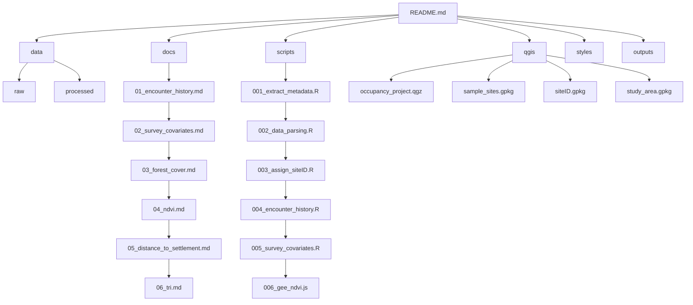

# Multiseason Occupancy Modeling Workflow for Wildlife Monitoring

This repository documents a complete workflow for preparing detection
histories, survey covariates ad spatial site covariates for multiseason
occupancy anlaysis using camera trap data, QGIS, Goolge Earth Engine and
R.

## Objectives:

-   Prepare Encounter history matrices for occupancy modeling
-   Generate observation covariates (effort, year)
-   Develop spatial site covariates:
    -   Forest cover
    -   Forest loss
    -   NDVI
    -   Distance to settlement
    -   TRI

## Repository Structure

## Workflow Overview

-   Prepare camera station metadata
-   Generate encounter history matrices in R
-   Create observation covariates
-   Prepare spatial covariates in QGIS and Google Earth Engine
-   Extract stie-level covariates
-   Organize outputs for occupancy modeling

## Site covariates

| Covariate           | Ecological Relevance      |
|---------------------|---------------------------|
| Forest cover        | Habitat availability      |
| Forest loss         | Habiatat disturbance      |
| NDVI                | Proxy for prey base index |
| Settlement distance | Human disturbance         |
| TRI                 | Habitat suitability       |

## Software Used

-   R 4.5.3
-   QGIS 3.44.9
-   Google Earth Engine
-   MODIS MOD13Q1 NDVI product
-   Hansen Global Forest Change dataset
-   GHSL settlement layer

## Documentation

-   [Encounter history matrix
    preparation](D:/R_projects/multiseason_occupancy/docs/01.encounter_history.md)
-   [Survey
    covariates](D:/R_projects/multiseason_occupancy/docs/02.survey_cov.md)
-   [Forest
    covariates](D:/R_projects/multiseason_occupancy/docs/03.forest_cover.md)
-   [NDVI
    covariates](D:/R_projects/multiseason_occupancy/docs/04.ndvi.md)
-   [Distance to
    settlement](D:/R_projects/multiseason_occupancy/docs/05.distance_to_settlement.md)
-   [Terrain ruggedness
    index](D:/R_projects/multiseason_occupancy/docs/06.tri.md)

## Outputs

-   Encounter history matrix
-   Effort matrix
-   Year matrix
-   Forest cover and loss covariate
-   NDVI covariae
-   Distance to settlement covariate
-   Terrain ruggedness index covariate
-   Raste outputs
-   Maps of different site covariates

## Future additions

-   Correlation analysis
-   Model fitting in R
-   Detection probability analysis
-   Model selection Workflow
-   Habitat suitability visualization
